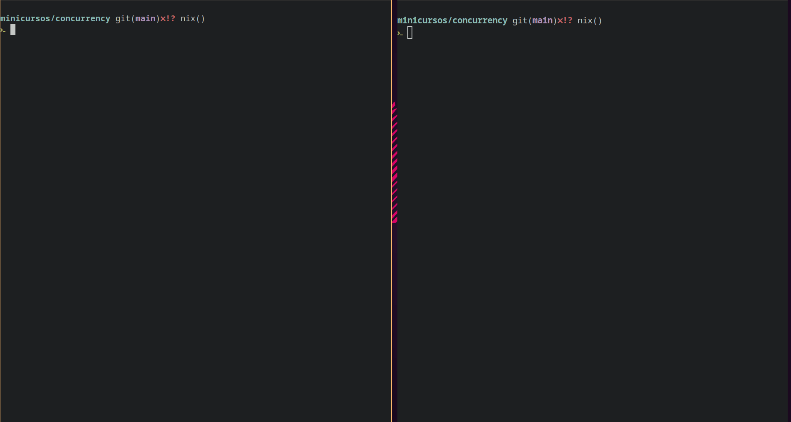
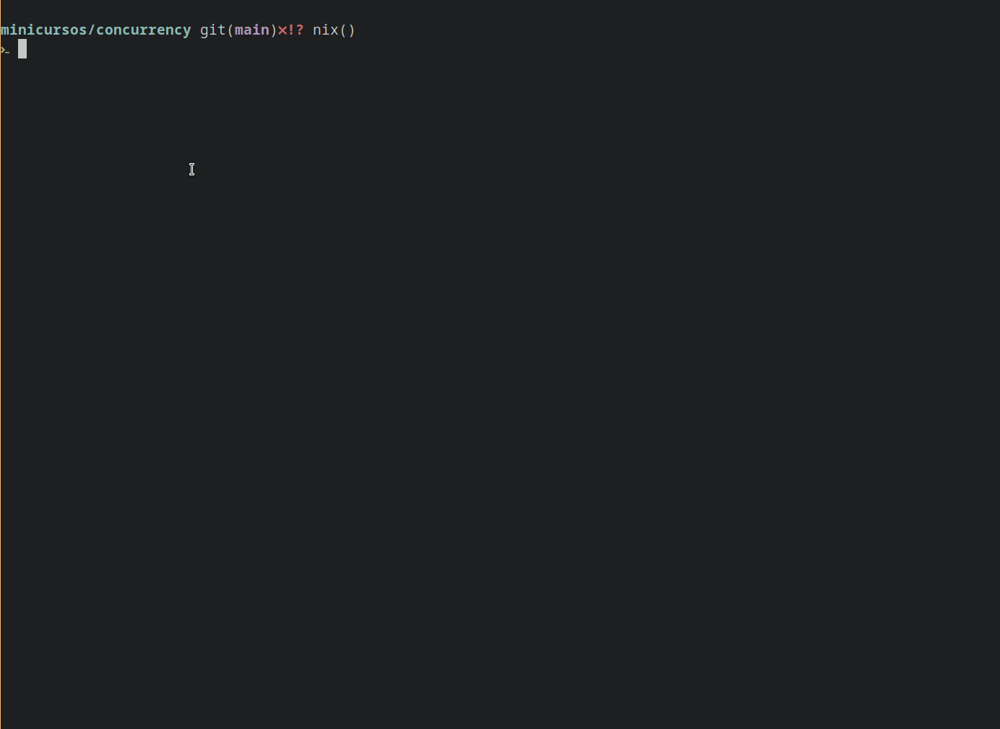
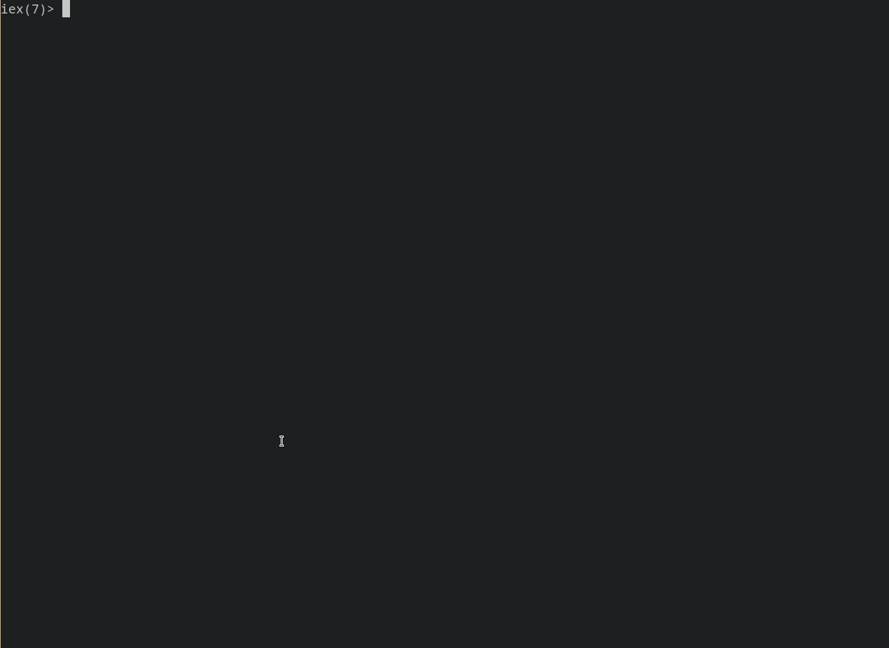

# Concorrência com Elixir

## Comunicações entre nós

Em um terminal execute (terminal A):

```sh dark
iex --sname foo --cookie secret
```

Em outro terminal execute (terminal B):

```sh dark
iex --sname bar --cookie scret
```

<div width="400">
  
</div>

### Lista de comandos (GIF)

#### Terminal A

- `Node.list`
- `Node.ping :"bar@<user>"`
- `c "01-greeting-rpc.exs"`

#### Terminal B

- `Node.list`
- `Node.list`
- `:rpc.call :"foo@<user>", Greeting, :say, ["MENSAGEM"]`

## Imutabilidade

``` elixir dark
a = 20

defmodule Teste do
  def teste do
    a = 40
    IO.puts("Hello, #{a}")
  end
end

IO.puts(a) # 20
Teste.teste() # 40
IO.puts(a) # 20
```

## Pattern Matching

Operação de igualdade, assim como na matemática, o lado esquerdo precisa
ser "igual" ou corresponder ao lado direito.

```elixir dark
[a, b, c] = [1, 2, 3]
```

```elixir dark
{:ok, msg} = {:ok, "eae!"}
```

Também é possível fazer isso nas declaraçòes de funções, como visto
no arquivo [02-pattern-matching](./concurrency/02-pattern-matching.exs)

## Processos e mensagens

<div width="400">
  
</div>

### Lista de comandos (GIF)

- `self`
- `send self, :hello`
- `flush`
- `send self, :hello`
-

```elixir dark
receive do
  :hello -> IO.puts "TAMO AQUI"
end
```

## Recebimento de mensagem constante

Veja o arquivo [03-process-message.exs](./concurrency/03-process-message.exs)

<div width="400">
  
</div>

### Lista de comandos (GIF)

- `c "03-process-message.exs"`
- `pid = spawn fn -> Exxemplo.fala end`
- `Process.alive? pid`
- `send pid, {:ok, "MENSAGEM"}`
- `send pid, {:ok, "OUTRA MENSAGEM"}`

## Processos com estado

Veja o arquivo [04-process-state.exs](./concurrency/04-process-state.exs)

### Lista de comandos

- `c "04-process-state.exs"`
- `pid = spawn fn -> Counter.count(1) end`
- `send pid, {:read, self}`
- `flush`
- `send pid, {:read, self}`
- `flush`

## Múltiplos de processos

```elixir dark
list = Enum.map(1..100_000, fn n ->
  spawn(fn -> Counter.count(n)) end)
end
```

### Comandos

- `Enum.count Process.list`
- `Enum.all? list, &Process.alive?/1`
- `Enum.each list, &Process.exit(&1, :kill)`
- `Enum.all? list, &Process.alive?/1`

## Tolerância a falhas

Veja o arquivo [05-fault-tolerancy.exs](./concurrency/05-fault-tolerancy.exs)

### Comandos

- `c "05-fault-tolerancy.exs"`
- `pid = spawn fn -> Counter.count(1) end`
- `Process.alive? pid`
- `send pid, {:read, self}`
- `flush`
- `Process.link(pid)`
- `Process.flag(:trap_exit, true)`
- `send pid, :blah`
- `flush`

## Observer

Veja o arquivo [06-observer.exs](./concurrency/06-observer.exs)

- `:observer.start()`

## Tasks

Abstrações para spawnnar processos e executar tarefas assíncronas

### Comandos

- `task = Task.async(fn -> 80 * 42 end)`
- `res = 10 + 20`
- `res + Tasl.await(task)`

## Agents

Abtração para manter estado em um processo separado!

Veja o arquivo [07-agent.exs](./concurrency/07-agent.exs)

## Genserver

Abstração para construção de serviço com estado ou não em processos separados.

Veja o arquivo [08-genserver.exs](./concurrency/07-genserver.exs)

## Supervisor

Abstração para construção de serviço com estado ou não em processos separados.

Veja o arquivo [09-supervisor.exs](./concurrency/08-supervisor.exs)
