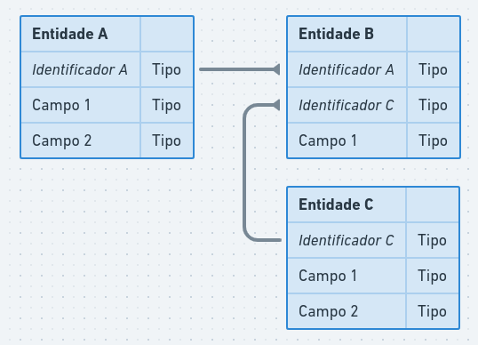

# SQL, NoSQL e NewSQL, quais as diferenças e quando usar?

### Glossário

- BD: Banco de dados
- SGBD: Sistema de Gerenciamento de Banco de Dados
- RDBMS: Sistema de Gerenciamento de Banco de Dados Relacional

## Introdução

O que é um Banco de Dados?

<div wdith="400">
  
</div>

Um Banco de Dados representa uma coleção de informações processadas,
organizadas e que precisam estar agrupadas em um certo padrão.

Existem diversos tipos de Banco de Dados, como:

- Banco de Dados relacionais
- Banco de Dados não relacionais
- Banco de Dados em grafos
- Banco de Dados em pares

Dentre outros... Veremos um pouco sobre Banco de Dados relacionais e não relacionais.

## Banco de Dados Relacionais

Dentro desse tipo de banco temos o conceito de tabelas e colunas que representam dados estruturados. E comummente a linguagem para se organizar e modificar os dados se chama SQL (linguagem de consulta estruturada).

### Exemplos de SGBD relacionais

- SQLite
- PostgreSQL
- MariaDB
- SQLServer
- CockroachDB

### Colunas

Uma estrutura que representa os atributos de uma entidade, por exemplo a entidade "usuário" pode ter email, nome e data de nascimento, que seriam colunas distintas respectivamente.

### Tabelas

Uma estrutura que agrupa uma ou várias colunas (atributos) que tem relação entre si, logo a tabela com os campos de exemplo acima seria "usuário".

### Diagrama Entidade Relacionamento (DER)

<div width="400">
  
</div>

### Modelagem física

```sql dark
CREATE DATABASE exemplo;

CREATE TABLE entidade_a (
  id INT PRIMARY KEY,
  campo_1 TEXT,
  campo_2 TEXT
);

CREATE TABLE entidade_c (
  id INT PRIMARY KEY,
  campo_1 INT,
  campo2 BOOLEAN
);

CREATE TABLE entidade_b (
  entidade_a_id INT NOT NULL,
  entidade_c_id INT NOT NULL,
  campo_1 TEXT,
  FOREIGN KEY (entidade_a_id) REFERENCES entidade_a (id),
  FOREIGN KEY (entidade_c_id) REFERENCES entidade_c (id)
);
```

### Tipos de Dados

#### SQLite

- `NULL`: valores nulos
- `INTEGER`: um inteiro com sinal, máximo de 8 bytes
- `REAL`: ponto flutuante, com máximo de 8 bytes
- `TEXT`: string em UTF-8
- `BLOB`: binário de arquivo

### CockroachDB

- `ARRAY`: coleção de dados do mesmo tipo
- `BIT`: string em binário
- `BOOL`: valor booleano `true` ou  `false`
- `DATE`: datas no formato ISO-8601
- `ENUM`: valor definido por usuário
- `DECIMAL`: ponto flutuante com valor exato, fixo
- `FLOAT`: ponto flutuante inexato com no máximo 8 bytes
- `INET`: endereço IPv4 ou IPv6
- `JSONB`: `JSON` em binário
- `INT`: inteiro com sinal, máximo de 8 bytes
- `SERIAL`: inteiro com valor padrão
- `STRING`: string em UTF-8
- `UUID`: valor hexadecimal

### Link para quadro (DER)

> senha "vj56dm"

https://whimsical.com/der-552PtzKZxnX9svdwZ6r5XQ@2Ux7TurymMytEvTBQAby

## Banco de Dados Não Relacionais

A maior diferença entre banco relacionais e não relacionais é que no segundo, não há
necessidade de estruturação das informações para serem armazenadas. Isto é, o esquema dos
dados é completamente livre para ser modificado e armazenado de forma dinâmica.

Como uma estrutura padronizada não é necessária, há diversas implementações possíveis para um banco não relacional, como:

- grafos
- documentos
- pares

### Exemplos de SGBD não relacionais

- MongoDB
- Redis
- DynamoDB
- Cassandra

### Coleções e documentos (MongoDB)

```js dark
// Coleção alunos

// Doc 1
[
  {
    name: 'alu1',
    birhtdate: '2001-07-27',
    status: 'F',
    groups: ['politics', 'news']
  },
  {
    name: 'sue',
    birhtdate: '2001-07-22',
    status: 'A',
    groups: ['news', 'mathematics']
  }
]
```

### Tipos de Dados

- `String`
- `Integer`: suporta valores de 32 a 64 bits
- `Double`: ponto flutuante com no máximo 8 bytes
- `Boolean`
- `Array`
- `Object`: tipo que referência um outro documento
- `Date`: objeto de data
- `Null`

## Desafios
